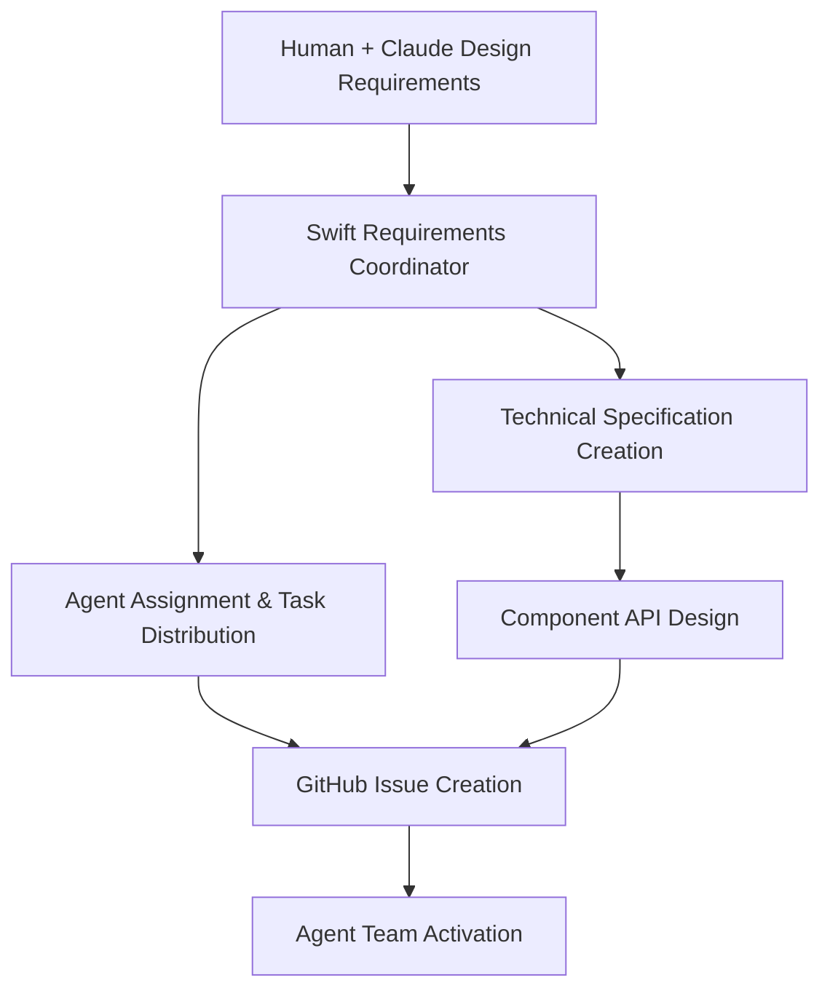
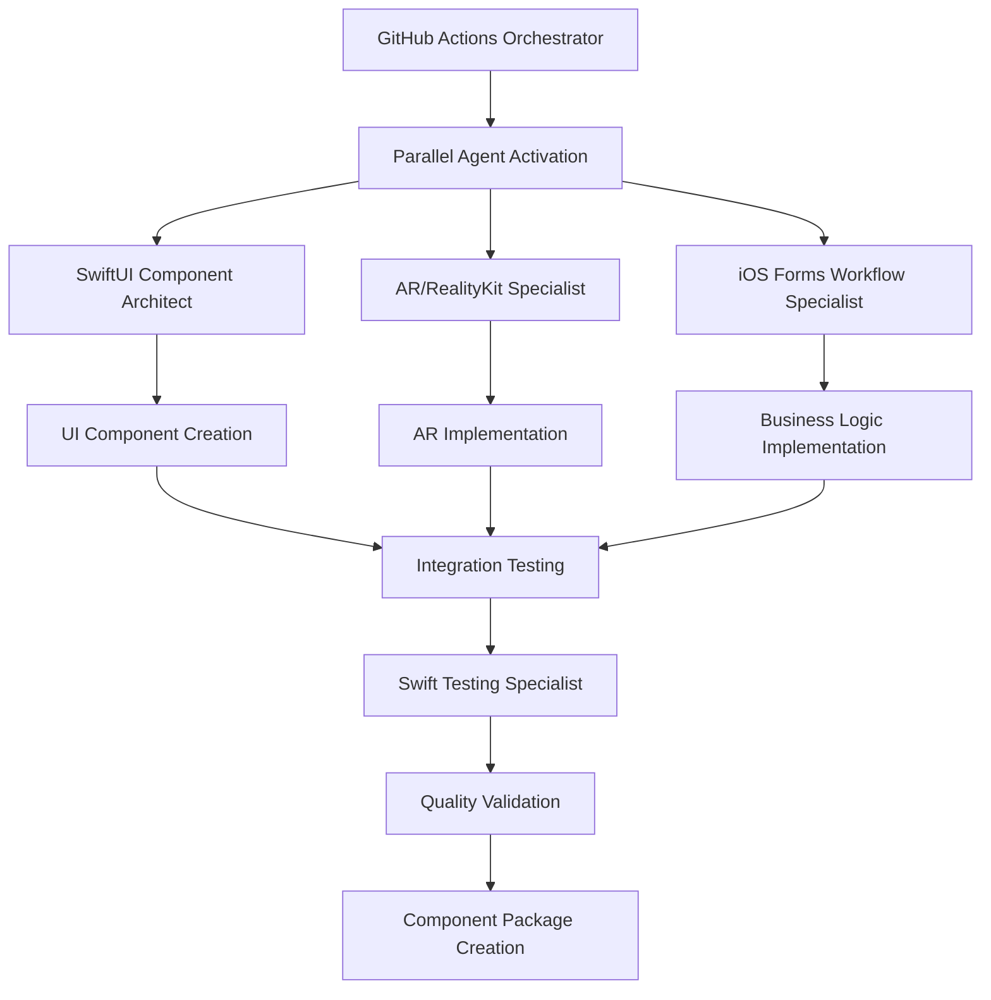
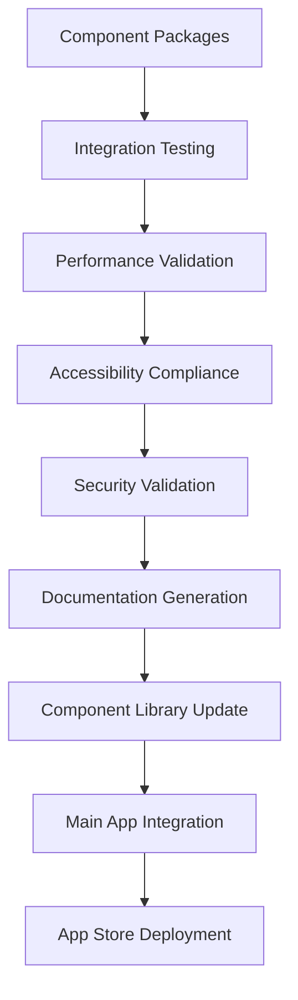

# Swift Agent Team Architecture for AR Tree Assessment App

## Overview

This document outlines a comprehensive specialized agent team architecture designed for building Swift/SwiftUI components for an AR tree assessment application. The system coordinates human requirements with AI agent specialists to deliver production-ready SwiftUI components through automated GitHub Actions workflows.

## Agent Team Structure

### Core Specialist Agents

#### 1. **SwiftUI Component Architect** (`swiftui-component-architect`)
- **Primary Role**: Reusable UI component library development
- **Specializations**: 
  - AR measurement overlays and indicators
  - Form-based assessment workflows
  - TreeScore visualization components
  - Safety alert and notification systems
  - Alex AI chat interface components
- **Key Deliverables**: Component libraries, design systems, accessibility compliance

#### 2. **AR/RealityKit Specialist** (`ar-realitykit-specialist`)
- **Primary Role**: AR measurement and 3D object detection
- **Specializations**:
  - LiDAR integration and precision measurement
  - Tree height, diameter, and volume calculation
  - Computer vision for tree identification
  - AR anchor management and persistence
  - Performance optimization for field use
- **Key Deliverables**: AR measurement systems, computer vision models, calibration frameworks

#### 3. **iOS Forms & Workflow Specialist** (`ios-forms-workflow-specialist`)
- **Primary Role**: Complex business workflow implementation
- **Specializations**:
  - Dynamic form generation and validation
  - TreeScore calculation implementation
  - Safety assessment protocol workflows
  - Multi-step assessment orchestration
  - Offline-first data handling
- **Key Deliverables**: Assessment workflows, business logic engines, compliance frameworks

#### 4. **Swift Testing & Integration Specialist** (`swift-testing-integration-specialist`)
- **Primary Role**: Comprehensive testing and quality assurance
- **Specializations**:
  - XCTest framework and UI testing automation
  - AR testing methodologies and validation
  - Performance testing and profiling
  - Accessibility compliance testing
  - CI/CD integration with GitHub Actions
- **Key Deliverables**: Test suites, performance benchmarks, quality gates

### Orchestration Agents

#### 5. **GitHub Actions Swift Orchestrator** (`github-actions-swift-orchestrator`)
- **Primary Role**: Workflow automation and agent coordination
- **Specializations**:
  - Multi-agent task distribution and coordination
  - CI/CD pipeline design and optimization
  - Component integration and validation workflows
  - Automated testing and deployment
- **Key Deliverables**: GitHub Actions workflows, automation pipelines, deployment systems

#### 6. **Swift Requirements Coordinator** (`swift-requirements-coordinator`)
- **Primary Role**: Project management and requirements translation
- **Specializations**:
  - Business requirement analysis and technical translation
  - Agent team coordination and task management
  - Cross-functional workflow orchestration
  - Quality assurance and delivery coordination
- **Key Deliverables**: Technical specifications, project coordination, stakeholder communication

## Workflow Architecture

### Phase 1: Requirements → Specifications



#### Process:
1. **Requirement Gathering**: Human + Claude collaborate to define component requirements
2. **Technical Translation**: Requirements Coordinator translates business needs to technical specs
3. **Agent Assignment**: Optimal agent selection based on requirements and specializations
4. **GitHub Integration**: Automated issue creation and project board setup
5. **Workflow Initiation**: GitHub Actions triggers appropriate agent workflows

### Phase 2: Component Development



#### Process:
1. **Parallel Development**: Multiple agents work simultaneously on different aspects
2. **Component Architecture**: SwiftUI architect creates reusable component structure
3. **AR Implementation**: AR specialist implements measurement and visualization features
4. **Business Logic**: Forms specialist implements workflows and calculations
5. **Integration**: Components are integrated and tested together
6. **Quality Assurance**: Comprehensive testing and validation
7. **Packaging**: Final component packaging and documentation

### Phase 3: Integration & Deployment



#### Process:
1. **Integration Testing**: Full integration testing across all components
2. **Quality Gates**: Performance, accessibility, and security validation
3. **Documentation**: Automated documentation generation
4. **Library Management**: Component library versioning and distribution
5. **App Integration**: Integration with main tree assessment application
6. **Deployment**: App Store deployment through existing Swift developer agent

## Component Library Architecture

### AR Measurement Kit
- **Components**: MeasurementOverlay, ARCrosshair, DistanceLabel, AccuracyIndicator
- **Lead Agent**: AR/RealityKit Specialist
- **Integration**: Real-time AR data → SwiftUI components → Form integration

### Assessment Forms Kit
- **Components**: TreeAssessmentForm, ConditionalFieldSet, PhotoAnnotationView, SignatureField
- **Lead Agent**: iOS Forms Workflow Specialist
- **Integration**: Dynamic forms → Business logic → Data persistence

### TreeScore Kit
- **Components**: TreeScoreDisplay, ProgressRing, ScoreBreakdown, ComparisonChart
- **Lead Agent**: SwiftUI Component Architect
- **Integration**: Real-time calculations → Visualization → Form workflows

### Safety Alert Kit
- **Components**: SafetyOverlay, WarningBanner, EmergencyButton, HazardIndicator
- **Lead Agent**: iOS Forms Workflow Specialist
- **Integration**: Safety protocols → AR overlays → Emergency systems

### Alex Chat Interface Kit
- **Components**: AlexChatView, MessageBubble, VoiceInput, QuickActions
- **Lead Agent**: SwiftUI Component Architect
- **Integration**: AI context → AR scene data → Assessment workflows

## GitHub Actions Workflow Templates

### Component Development Workflow

```yaml
name: SwiftUI Component Development
on:
  issues:
    types: [labeled]
  workflow_dispatch:

jobs:
  requirement-analysis:
    runs-on: ubuntu-latest
    outputs:
      component-spec: ${{ steps.analysis.outputs.spec }}
      agent-assignments: ${{ steps.analysis.outputs.agents }}
    steps:
      - name: Analyze Requirements
        id: analysis
        uses: ./.github/actions/requirement-analysis
        with:
          issue-body: ${{ github.event.issue.body }}

  parallel-development:
    needs: requirement-analysis
    strategy:
      matrix:
        agent: ${{ fromJson(needs.requirement-analysis.outputs.agent-assignments) }}
    runs-on: macos-latest
    steps:
      - name: Agent Development
        uses: ./.github/actions/agent-development
        with:
          agent: ${{ matrix.agent }}
          specification: ${{ needs.requirement-analysis.outputs.component-spec }}

  integration-testing:
    needs: parallel-development
    runs-on: macos-latest
    steps:
      - name: Component Integration
        uses: ./.github/actions/swift-testing
        with:
          test-suite: integration
          
  quality-validation:
    needs: integration-testing
    runs-on: macos-latest
    steps:
      - name: Accessibility Check
        uses: ./.github/actions/accessibility-validation
      - name: Performance Test
        uses: ./.github/actions/performance-testing
      - name: Security Scan
        uses: ./.github/actions/security-scanning

  deployment:
    needs: quality-validation
    runs-on: macos-latest
    steps:
      - name: Package Component
        uses: ./.github/actions/swift-package-deploy
      - name: Update Documentation
        uses: ./.github/actions/docc-deploy
```

### Continuous Integration Workflow

```yaml
name: Swift Agent Team CI
on: [push, pull_request]

jobs:
  code-quality:
    runs-on: macos-latest
    steps:
      - name: SwiftLint
        run: swiftlint --strict
      - name: Code Coverage
        run: xcodebuild test -enableCodeCoverage YES
      - name: Documentation Check
        run: swift-doc generate

  testing-matrix:
    strategy:
      matrix:
        device: [iPhone_14, iPhone_14_Pro, iPad_Air]
        ios_version: [15.0, 16.0, 17.0]
    runs-on: macos-latest
    steps:
      - name: Run Tests
        run: |
          xcrun simctl create test-device "${{ matrix.device }}" "${{ matrix.ios_version }}"
          xcodebuild test -destination "name=test-device"

  performance-benchmarks:
    runs-on: macos-latest
    steps:
      - name: Memory Profiling
        uses: ./.github/actions/memory-profiling
      - name: CPU Profiling  
        uses: ./.github/actions/cpu-profiling
      - name: Battery Testing
        uses: ./.github/actions/battery-testing
```

## Agent Coordination Protocols

### Communication Standards

#### Status Reporting Format
```json
{
  "agent": "swiftui-component-architect",
  "task_id": "ar-measurement-overlay-001",
  "status": "in_progress",
  "progress": 65,
  "estimated_completion": "2024-01-15T18:00:00Z",
  "deliverables": [
    {
      "name": "MeasurementOverlay.swift",
      "status": "completed",
      "path": "Sources/ARMeasurementKit/MeasurementOverlay.swift"
    }
  ],
  "dependencies": [
    {
      "agent": "ar-realitykit-specialist", 
      "task": "ar-anchor-management",
      "status": "waiting"
    }
  ],
  "issues": []
}
```

#### Work Handoff Protocol
1. **Completion Notification**: Agent completes task and notifies orchestrator
2. **Artifact Transfer**: Work artifacts uploaded to shared repository
3. **Context Documentation**: Work context and decisions documented
4. **Quality Validation**: Automated quality checks executed
5. **Next Agent Notification**: Dependent agents notified of readiness

### Quality Gates

#### Component Quality Standards
- **Code Coverage**: Minimum 90% test coverage
- **Performance**: 60fps rendering, <100ms response time
- **Accessibility**: Full VoiceOver compatibility, WCAG 2.1 AA compliance
- **Documentation**: Complete API documentation with examples
- **Security**: No security vulnerabilities, privacy compliance

#### Integration Requirements
- **API Compatibility**: Backward compatible API changes only
- **Dependency Management**: Minimal external dependencies
- **Platform Support**: iOS 15+, iPadOS 15+
- **Device Compatibility**: iPhone, iPad, with/without LiDAR

## Usage Examples

### Example 1: AR Measurement Component Request

**Human Input**:
```
We need an AR measurement overlay component that displays real-time distance measurements between two points, with accuracy indicators and unit conversion support.
```

**Automated Workflow**:
1. **Requirements Coordinator** analyzes and creates technical specification
2. **GitHub Actions** creates issues and assigns agents:
   - AR/RealityKit Specialist: AR measurement implementation
   - SwiftUI Component Architect: Overlay UI components
   - Testing Specialist: Accuracy validation tests
3. **Parallel Development** begins with coordinated handoffs
4. **Integration Testing** validates complete functionality
5. **Component Package** delivered with documentation and tests

### Example 2: TreeScore Calculation Display

**Human Input**:
```
Create a TreeScore visualization component that shows real-time score calculations with component breakdowns, progress indicators, and comparison capabilities.
```

**Automated Workflow**:
1. **Requirements Analysis** identifies need for calculation engine + visualization
2. **Agent Assignment**:
   - Forms Workflow Specialist: Calculation logic and business rules
   - SwiftUI Component Architect: Visualization components
   - Testing Specialist: Calculation accuracy and UI tests
3. **Coordinated Development** with shared calculation APIs
4. **Quality Validation** ensures accuracy and performance
5. **Deployment** to component library with examples

## Benefits of This Architecture

### For Development Teams
- **Specialized Expertise**: Each agent focuses on their core competency
- **Parallel Development**: Multiple components developed simultaneously
- **Quality Assurance**: Comprehensive testing and validation
- **Consistency**: Standardized patterns and practices across components

### For Project Management
- **Predictable Delivery**: Well-defined workflows and timelines
- **Risk Mitigation**: Early issue identification and resolution
- **Progress Visibility**: Real-time progress tracking and reporting
- **Quality Control**: Automated quality gates and validation

### For Business Stakeholders
- **Rapid Delivery**: Accelerated component development cycles
- **High Quality**: Production-ready components with comprehensive testing
- **Maintainability**: Well-documented, modular, and testable components
- **Scalability**: Reusable components across multiple projects

## Getting Started

### Prerequisites
1. GitHub repository with Actions enabled
2. Xcode 15+ and iOS 15+ development environment
3. Swift Package Manager for component distribution
4. Convex backend integration setup

### Setup Process
1. **Clone agent configurations** from this repository
2. **Configure GitHub Actions** workflows in your repository
3. **Set up component library** structure and Swift packages
4. **Configure agent coordination** protocols and communication
5. **Test workflow** with simple component request

### First Component Request
1. Create GitHub issue with component requirements
2. Label issue with `component-request` 
3. GitHub Actions will automatically:
   - Analyze requirements
   - Assign appropriate agents
   - Begin development workflow
   - Provide progress updates
   - Deliver completed component

This architecture provides a comprehensive, automated, and scalable approach to building high-quality SwiftUI components for AR tree assessment applications through specialized AI agent coordination.