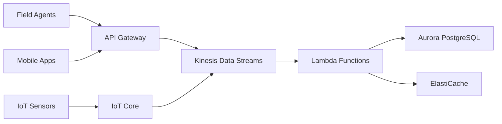

# TreeAI Cloud Infrastructure Architecture

## Executive Summary

This document outlines the comprehensive cloud infrastructure architecture for the TreeAI ecosystem, designed to support 30 agents with real-time processing capabilities, multi-region deployment, auto-scaling for seasonal demand, and enterprise-grade reliability.

## Architecture Overview

### Core Components

1. **Compute Layer**: Container orchestration with auto-scaling
2. **Data Layer**: Multi-tier database architecture
3. **Real-time Processing**: Event-driven streaming pipeline
4. **Network Layer**: Global CDN with edge computing
5. **Security Layer**: Zero-trust architecture with encryption
6. **Monitoring Layer**: Comprehensive observability stack

### Multi-Region Strategy

**Primary Regions:**
- **US East (N. Virginia)**: Primary for North American operations
- **EU West (Ireland)**: Primary for European operations
- **Asia Pacific (Sydney)**: Primary for APAC operations

**Secondary Regions (DR):**
- US West (Oregon), EU Central (Frankfurt), Asia Pacific (Tokyo)

## Detailed Architecture Components

### 1. Compute Infrastructure

#### Container Orchestration
- **AWS**: Amazon EKS with managed node groups
- **Azure**: Azure Kubernetes Service (AKS)
- **GCP**: Google Kubernetes Engine (GKE)

#### Auto-scaling Configuration
```yaml
# Horizontal Pod Autoscaler
apiVersion: autoscaling/v2
kind: HorizontalPodAutoscaler
metadata:
  name: treeai-agent-hpa
spec:
  scaleTargetRef:
    apiVersion: apps/v1
    kind: Deployment
    name: treeai-agent
  minReplicas: 10
  maxReplicas: 150
  metrics:
  - type: Resource
    resource:
      name: cpu
      target:
        type: Utilization
        averageUtilization: 70
  - type: Resource
    resource:
      name: memory
      target:
        type: Utilization
        averageUtilization: 80
```

#### Seasonal Scaling Strategy
- **Spring/Summer (Peak)**: Scale to 200% capacity (60 agents)
- **Fall (Moderate)**: Maintain 100% capacity (30 agents)
- **Winter (Low)**: Scale down to 30% capacity (9 agents)
- **Emergency Events**: Burst scale to 500% capacity (150 agents) in 5 minutes

### 2. Database Architecture

#### Primary Database (AFISS Data)
- **AWS**: Aurora PostgreSQL Multi-AZ
- **Azure**: Azure Database for PostgreSQL Flexible Server
- **GCP**: Cloud SQL for PostgreSQL with high availability

#### Analytics Database (TreeScore Calculations)
- **AWS**: Amazon Redshift with RA3 instances
- **Azure**: Azure Synapse Analytics
- **GCP**: BigQuery with partitioned tables

#### Caching Layer
- **AWS**: ElastiCache for Redis Cluster Mode
- **Azure**: Azure Cache for Redis Premium
- **GCP**: Memorystore for Redis with high availability

#### Search & Indexing
- **AWS**: Amazon OpenSearch Service
- **Azure**: Azure Cognitive Search
- **GCP**: Elasticsearch on Google Cloud

### 3. Real-time Data Processing Pipeline

#### Data Ingestion


#### Stream Processing Architecture
- **Data Ingestion**: Kinesis Data Streams (10 shards, 10,000 records/sec)
- **Real-time Analytics**: Kinesis Analytics for TreeScore calculations
- **Event Processing**: Lambda functions with concurrent execution
- **Agent Coordination**: Amazon SQS with FIFO queues

### 4. Cost Optimization Strategy

#### Compute Cost Optimization
- **Spot Instances**: 70% of workload on spot instances (60-90% savings)
- **Reserved Instances**: 30% on reserved instances for baseline load
- **Rightsizing**: Automated instance recommendations and resizing
- **Serverless-first**: Lambda/Functions for variable workloads

#### Storage Cost Optimization
- **Intelligent Tiering**: S3 Intelligent Tiering for automatic optimization
- **Lifecycle Policies**: Move data to cheaper storage classes
- **Compression**: LZ4 compression for database storage
- **Archive Strategy**: Glacier/Archive for data older than 1 year

#### Estimated Monthly Costs

| Season | Compute | Storage | Data Transfer | Total |
|--------|---------|---------|---------------|-------|
| Peak (Summer) | $18,000 | $8,000 | $4,000 | $30,000 |
| Normal | $12,000 | $6,000 | $2,500 | $20,500 |
| Low (Winter) | $6,000 | $4,000 | $1,500 | $11,500 |

### 5. Disaster Recovery & Backup

#### Recovery Time Objectives (RTO)
- **Critical Services**: 15 minutes
- **Database**: 30 minutes
- **Full System**: 2 hours

#### Recovery Point Objectives (RPO)
- **Real-time Data**: 5 minutes
- **AFISS Data**: 1 hour
- **Analytics Data**: 4 hours

#### Backup Strategy
- **Automated Backups**: Daily with 30-day retention
- **Point-in-time Recovery**: Last 7 days
- **Cross-region Replication**: Real-time for critical data
- **Backup Testing**: Monthly restoration drills

### 6. Security Architecture

#### Network Security
- **VPC Design**: Multi-tier with public, private, and database subnets
- **Security Groups**: Least privilege access rules
- **NACLs**: Additional network-level security
- **VPN/Direct Connect**: Secure hybrid connectivity

#### Data Security
- **Encryption at Rest**: AES-256 for all storage
- **Encryption in Transit**: TLS 1.3 for all communications
- **Key Management**: AWS KMS/Azure Key Vault/Cloud KMS
- **Database Encryption**: Transparent data encryption

#### Access Control
- **IAM Strategy**: Role-based access control (RBAC)
- **Multi-factor Authentication**: Required for all administrative access
- **Service Accounts**: Minimal permissions for application services
- **Audit Logging**: Comprehensive access and activity logging

### 7. Monitoring & Observability

#### Application Performance Monitoring
- **Metrics Collection**: Prometheus with custom TreeAI metrics
- **Visualization**: Grafana dashboards for real-time monitoring
- **Distributed Tracing**: Jaeger for request flow tracking
- **Application Insights**: Performance and error monitoring

#### Infrastructure Monitoring
- **Resource Monitoring**: CloudWatch/Azure Monitor/Cloud Monitoring
- **Network Monitoring**: VPC Flow Logs and network performance
- **Security Monitoring**: GuardDuty/Azure Sentinel/Security Command Center
- **Cost Monitoring**: Daily cost alerts and budget tracking

#### Alerting Strategy
- **Critical Alerts**: PagerDuty integration with 5-minute SLA
- **Warning Alerts**: Slack/Teams integration
- **Escalation Policies**: Multi-level escalation with runbooks
- **SLA Monitoring**: 99.9% uptime target with automated reporting

### 8. Integration Architecture

#### Alex's Assessment Engine Integration
- **API Gateway**: RESTful APIs with rate limiting and authentication
- **Message Queues**: Asynchronous processing for assessment requests
- **WebSocket Connections**: Real-time communication for live assessments
- **State Management**: Distributed state store for assessment progress

#### Agent Coordination
- **Service Mesh**: Istio for microservices communication
- **Load Balancing**: Application Load Balancer with health checks
- **Circuit Breakers**: Hystrix pattern for fault tolerance
- **Event Bus**: Event-driven architecture for loose coupling

## Implementation Roadmap

### Phase 1: Foundation (Weeks 1-4)
- Deploy core infrastructure in primary region
- Set up basic monitoring and logging
- Implement security baseline

### Phase 2: Multi-region (Weeks 5-8)
- Deploy secondary regions
- Configure cross-region replication
- Implement disaster recovery procedures

### Phase 3: Optimization (Weeks 9-12)
- Implement auto-scaling policies
- Optimize costs and performance
- Complete monitoring and alerting

### Phase 4: Production (Weeks 13-16)
- Load testing and performance tuning
- Security audits and compliance
- Go-live with production workloads

## Cloud Provider Recommendations

### Primary Recommendation: AWS
- **Pros**: Mature services, extensive partner ecosystem, global presence
- **Cons**: Higher cost, complex pricing model
- **Best for**: Large-scale enterprise deployments

### Secondary Recommendation: Azure
- **Pros**: Strong enterprise integration, hybrid cloud capabilities
- **Cons**: Newer services, smaller ecosystem
- **Best for**: Microsoft-centric organizations

### Alternative: Google Cloud
- **Pros**: Strong ML/AI services, competitive pricing
- **Cons**: Smaller enterprise market share
- **Best for**: Data analytics and machine learning workloads

## Next Steps

1. Review and approve architecture design
2. Set up Terraform state management
3. Configure CI/CD pipelines
4. Begin Phase 1 implementation
5. Establish monitoring and alerting baselines