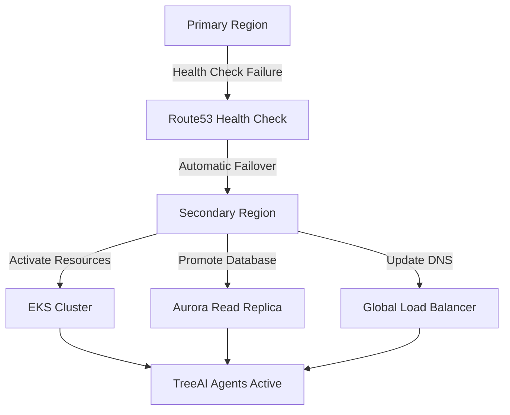

# TreeAI Disaster Recovery Plan

## Executive Summary

This document outlines the comprehensive disaster recovery (DR) strategy for the TreeAI ecosystem, ensuring business continuity and minimal service disruption during various failure scenarios. The plan covers regional failures, data corruption, security incidents, and natural disasters.

## Recovery Objectives

### Recovery Time Objectives (RTO)
- **Critical Services**: 15 minutes
- **Database Services**: 30 minutes
- **Full System Recovery**: 2 hours
- **Data Analytics**: 4 hours

### Recovery Point Objectives (RPO)
- **Real-time Assessment Data**: 5 minutes
- **AFISS Database**: 1 hour
- **Analytics and Reporting**: 4 hours
- **System Logs**: 24 hours

## Infrastructure Resilience

### Multi-Region Architecture

#### Primary Regions
1. **US East (N. Virginia)** - Primary production
2. **EU West (Ireland)** - European operations
3. **Asia Pacific (Sydney)** - APAC operations

#### Secondary Regions (DR)
1. **US West (Oregon)** - DR for US East
2. **EU Central (Frankfurt)** - DR for EU West
3. **Asia Pacific (Tokyo)** - DR for Sydney

### Failover Strategy



## Backup Strategy

### Database Backups

#### Aurora PostgreSQL
- **Automated Backups**: Every 15 minutes (point-in-time recovery)
- **Daily Snapshots**: Retained for 30 days
- **Weekly Full Backups**: Retained for 1 year
- **Cross-region Replication**: Real-time to DR regions
- **Backup Testing**: Weekly automated restoration tests

#### ElastiCache Redis
- **Daily Snapshots**: Automatic backup to S3
- **Cross-region Replication**: Enabled for all clusters
- **Recovery Time**: <5 minutes from snapshot

### Application Data Backups

#### File Storage (S3)
- **Versioning**: Enabled on all buckets
- **Cross-region Replication**: Automatic to DR regions
- **Lifecycle Management**: Archive to Glacier after 90 days
- **Backup Verification**: Monthly integrity checks

#### Configuration and Secrets
- **Terraform State**: Versioned in S3 with cross-region replication
- **Kubernetes Secrets**: Backed up to encrypted S3 buckets
- **Configuration Management**: GitOps with multiple repository mirrors

### Backup Schedule

| Component | Frequency | Retention | Cross-Region |
|-----------|-----------|-----------|--------------|
| Aurora DB | 15 minutes | 30 days | Real-time |
| EKS Volumes | Daily | 7 days | Yes |
| S3 Data | Real-time | 1 year | Yes |
| Config Data | On change | 1 year | Yes |
| System Logs | Hourly | 90 days | Yes |

## Disaster Scenarios and Procedures

### Scenario 1: Single Region Failure

#### Detection
- Route53 health checks fail for 3 consecutive checks (3 minutes)
- CloudWatch alarms trigger for infrastructure metrics
- Automated monitoring detects API response failures

#### Response Procedure
```bash
# Automatic failover process (handled by Route53)
1. Route53 detects health check failure
2. DNS traffic routed to secondary region
3. Aurora read replica promoted to primary
4. EKS cluster scaled up in DR region
5. Application pods deployed from container registry

# Manual verification steps
kubectl get nodes --context=dr-region
kubectl get pods -A --context=dr-region
aws rds describe-db-clusters --region us-west-2
```

#### Recovery Steps
1. **Immediate (0-15 minutes)**
   - Confirm automatic failover completion
   - Verify agent connectivity to DR region
   - Check data consistency between regions

2. **Short-term (15-60 minutes)**
   - Scale up DR region to full capacity
   - Validate all TreeAI agents are operational
   - Perform data integrity checks

3. **Recovery (1-4 hours)**
   - Investigate and resolve primary region issues
   - Plan failback procedure
   - Communicate status to stakeholders

### Scenario 2: Database Corruption/Failure

#### Detection
- Database connection failures
- Data integrity check failures
- Automated health checks fail

#### Response Procedure
```sql
-- Database health checks
SELECT COUNT(*) FROM treeai_assessments WHERE created_at > NOW() - INTERVAL '1 hour';
SELECT pg_is_in_recovery(); -- Check if in recovery mode

-- Point-in-time recovery
aws rds restore-db-cluster-to-point-in-time \
  --source-db-cluster-identifier treeai-prod-aurora \
  --db-cluster-identifier treeai-recovery-$(date +%Y%m%d-%H%M%S) \
  --restore-to-time $(date -u -d '30 minutes ago' +%Y-%m-%dT%H:%M:%S.000Z)
```

#### Recovery Steps
1. **Immediate (0-5 minutes)**
   - Stop write operations to corrupted database
   - Switch reads to nearest read replica
   - Begin point-in-time recovery process

2. **Recovery (5-30 minutes)**
   - Restore database from latest clean backup
   - Validate data integrity
   - Resume write operations

3. **Verification (30-60 minutes)**
   - Run comprehensive data validation
   - Check application functionality
   - Monitor for any data inconsistencies

### Scenario 3: Complete System Compromise

#### Detection
- Security monitoring alerts (GuardDuty, Security Hub)
- Unusual network traffic patterns
- Unauthorized access attempts
- Data exfiltration alerts

#### Response Procedure
```bash
# Immediate containment
aws ec2 stop-instances --instance-ids $(aws ec2 describe-instances --query 'Reservations[*].Instances[*].InstanceId' --output text)
aws rds stop-db-cluster --db-cluster-identifier treeai-prod-aurora

# Network isolation
aws ec2 revoke-security-group-ingress --group-id sg-12345678 --protocol all --port all --cidr 0.0.0.0/0

# Evidence preservation
aws s3 sync s3://treeai-logs/ s3://treeai-incident-evidence-$(date +%Y%m%d)/
```

#### Recovery Steps
1. **Containment (0-30 minutes)**
   - Isolate affected systems
   - Preserve evidence for investigation
   - Activate incident response team

2. **Investigation (30 minutes - 4 hours)**
   - Forensic analysis of compromised systems
   - Identify scope of breach
   - Determine attack vectors

3. **Recovery (4-24 hours)**
   - Deploy clean infrastructure from IaC
   - Restore data from clean backups
   - Implement additional security measures

### Scenario 4: Natural Disaster

#### Regional Disaster Response
For major natural disasters affecting entire AWS regions:

1. **Immediate Response (0-1 hour)**
   - Activate global failover procedures
   - Route all traffic to unaffected regions
   - Scale up capacity in operational regions

2. **Capacity Management (1-24 hours)**
   - Redistribute load across remaining regions
   - Deploy additional resources as needed
   - Monitor performance and adjust scaling

3. **Business Continuity (24+ hours)**
   - Coordinate with AWS for region recovery
   - Plan for increased costs during disaster
   - Communicate with customers about service levels

## Monitoring and Alerting

### Health Check Configuration

#### Application Health Checks
```yaml
health_checks:
  - endpoint: "/health"
    interval: 30s
    timeout: 10s
    healthy_threshold: 2
    unhealthy_threshold: 3
  
  - endpoint: "/ready"
    interval: 10s
    timeout: 5s
    healthy_threshold: 2
    unhealthy_threshold: 2
```

#### Infrastructure Health Checks
- **Route53**: Health checks every 30 seconds
- **Application Load Balancer**: Health checks every 30 seconds
- **EKS Pods**: Liveness and readiness probes
- **Database**: Connection and query health checks

### Alert Configuration

#### Critical Alerts (PagerDuty)
- Region-wide service failure
- Database cluster failure
- Security incidents
- Data corruption detected

#### Warning Alerts (Slack)
- High error rates (>1%)
- Elevated response times (>500ms)
- Resource utilization >80%
- Backup failures

### Monitoring Dashboard

```yaml
critical_metrics:
  - service_availability: >99.9%
  - response_time_p95: <200ms
  - error_rate: <0.1%
  - database_connections: <80% of max

infrastructure_metrics:
  - cpu_utilization: <70%
  - memory_utilization: <80%
  - disk_utilization: <70%
  - network_throughput: monitoring
```

## Testing and Validation

### DR Testing Schedule

#### Monthly Tests
- **Application Failover**: Test automatic failover to DR region
- **Database Recovery**: Point-in-time recovery testing
- **Backup Validation**: Restore random backup and verify integrity

#### Quarterly Tests
- **Full DR Exercise**: Complete regional failover simulation
- **Security Incident Response**: Tabletop exercise
- **Chaos Engineering**: Intentional failure injection

#### Annual Tests
- **Disaster Simulation**: Multi-region failure scenario
- **Business Continuity**: End-to-end process validation
- **Third-party Integration**: Vendor failover testing

### Test Procedures

#### Database Recovery Test
```bash
#!/bin/bash
# Monthly database recovery test
DATE=$(date +%Y%m%d-%H%M%S)
TEST_CLUSTER="treeai-test-recovery-$DATE"

# Create test recovery
aws rds restore-db-cluster-to-point-in-time \
  --source-db-cluster-identifier treeai-prod-aurora \
  --db-cluster-identifier $TEST_CLUSTER \
  --restore-to-time $(date -u -d '1 hour ago' +%Y-%m-%dT%H:%M:%S.000Z)

# Wait for cluster to be available
aws rds wait db-cluster-available --db-cluster-identifier $TEST_CLUSTER

# Run validation queries
psql -h $TEST_CLUSTER.cluster-xyz.region.rds.amazonaws.com -U admin -d treeai \
  -c "SELECT COUNT(*) FROM treeai_assessments;"

# Cleanup
aws rds delete-db-cluster --db-cluster-identifier $TEST_CLUSTER --skip-final-snapshot
```

## Communication Plan

### Stakeholder Notification

#### Internal Team
- **Immediate**: Slack alerts to #incidents channel
- **15 minutes**: Email to engineering team
- **1 hour**: Status update to executive team

#### Customer Communication
- **30 minutes**: Status page update
- **1 hour**: Customer email notification
- **Regular updates**: Every 2 hours until resolved

#### Escalation Matrix
1. **Level 1**: On-call engineer
2. **Level 2**: Engineering manager
3. **Level 3**: CTO/VP Engineering
4. **Level 4**: CEO (for critical business impact)

### Communication Templates

#### Initial Incident Alert
```
Subject: [INCIDENT] TreeAI Service Disruption - Region Failover

We are currently experiencing service disruption in the US-East region.
- Impact: Potential delays in tree assessments
- Status: Automatic failover to US-West in progress
- ETA: Service restoration within 15 minutes
- Updates: Every 30 minutes until resolved

Incident ID: INC-YYYY-MM-DD-001
```

## Recovery Procedures Documentation

### Standard Operating Procedures (SOPs)

#### SOP-001: Regional Failover
1. Verify health check failures
2. Confirm automatic DNS failover
3. Scale up DR region capacity
4. Validate agent connectivity
5. Monitor data consistency
6. Document incident timeline

#### SOP-002: Database Recovery
1. Identify recovery point objective
2. Stop write operations
3. Initiate point-in-time recovery
4. Validate restored data
5. Resume application connections
6. Monitor performance metrics

#### SOP-003: Security Incident Response
1. Contain and isolate systems
2. Preserve evidence
3. Assess scope of impact
4. Notify security team
5. Begin forensic investigation
6. Coordinate with legal/compliance

## Continuous Improvement

### Post-Incident Review Process

#### Incident Analysis
- Timeline reconstruction
- Root cause analysis
- Impact assessment
- Response effectiveness review

#### Action Items
- Infrastructure improvements
- Process refinements
- Training updates
- Documentation updates

### DR Plan Updates

#### Quarterly Reviews
- Update contact information
- Review and test procedures
- Update recovery objectives
- Validate backup strategies

#### Annual Reviews
- Full plan revision
- Technology updates
- Business requirement changes
- Vendor capability assessments

This disaster recovery plan ensures the TreeAI ecosystem can maintain operations and recover quickly from various failure scenarios while protecting data integrity and meeting business continuity requirements.