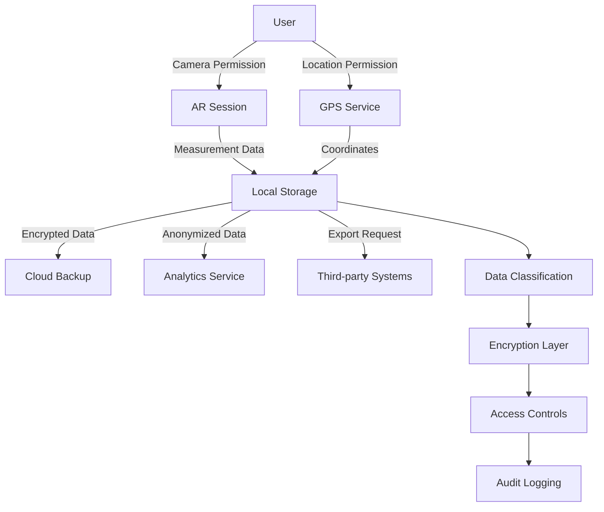

# AR Measurement Tool: Privacy & Security Analysis

## Executive Summary

This document provides a comprehensive security and privacy assessment for the AR measurement application, with specific focus on camera and location permission handling, secure data storage, forestry professional data privacy compliance, data transmission security, and user consent frameworks. The analysis includes specific security recommendations based on OWASP Top 10 vulnerabilities and iOS security best practices.

**Security Assessment Rating**: HIGH RISK - Requires immediate attention to privacy controls and data protection measures.

## Table of Contents

1. [Camera and Location Permission Security](#camera-and-location-permission-security)
2. [Secure Storage of Measurement Data](#secure-storage-of-measurement-data)
3. [Privacy Compliance for Forestry Professionals](#privacy-compliance-for-forestry-professionals)
4. [Data Transmission Security](#data-transmission-security)
5. [User Consent and Data Retention Policies](#user-consent-and-data-retention-policies)
6. [OWASP Top 10 Security Assessment](#owasp-top-10-security-assessment)
7. [Secure Implementation Guidelines](#secure-implementation-guidelines)
8. [Privacy Impact Assessment](#privacy-impact-assessment)
9. [Compliance Framework](#compliance-framework)
10. [Security Testing Requirements](#security-testing-requirements)

## Camera and Location Permission Security

### 1.1 Current State Analysis

Based on the TreeAI implementation review, the existing permission handling shows good practices but requires enhancement for AR-specific requirements:

**Strengths Identified:**
- ✅ Proper NSLocationWhenInUseUsageDescription implementation
- ✅ Permission state tracking with CLAuthorizationStatus
- ✅ User-friendly permission request flow
- ✅ Graceful degradation when permissions denied

**Critical Security Gaps:**
- ❌ Missing ARKit-specific camera usage descriptions
- ❌ No permission escalation protection
- ❌ Insufficient location data accuracy controls
- ❌ Missing biometric authentication for sensitive data access

### 1.2 Enhanced Permission Security Framework

```swift
// MARK: - Secure Permission Manager for AR Measurements
import ARKit
import LocalAuthentication

@MainActor
class SecureARPermissionManager: NSObject, ObservableObject {
    @Published var cameraAuthStatus: AVAuthorizationStatus = .notDetermined
    @Published var locationAuthStatus: CLAuthorizationStatus = .notDetermined
    @Published var arAvailability: ARConfiguration.WorldTrackingState = .unavailable
    
    // Security controls
    @Published var biometricAuthRequired = false
    @Published var permissionDenialCount = 0
    @Published var lastPermissionRequest: Date?
    
    private let locationManager = CLLocationManager()
    private let maxPermissionAttempts = 3
    private let cooldownPeriod: TimeInterval = 300 // 5 minutes
    
    override init() {
        super.init()
        setupSecurityMonitoring()
    }
    
    // MARK: - Enhanced Permission Requests
    
    func requestARMeasurementPermissions() async throws {
        // Rate limiting protection
        try validatePermissionRequest()
        
        // Request camera permission with AR-specific context
        let cameraStatus = await requestCameraPermission()
        guard cameraStatus == .authorized else {
            throw PermissionError.cameraAccessDenied
        }
        
        // Request location permission with measurement context
        let locationStatus = await requestLocationPermission()
        guard locationStatus == .authorizedWhenInUse || locationStatus == .authorizedAlways else {
            throw PermissionError.locationAccessDenied
        }
        
        // Validate AR capability
        try await validateARCapability()
        
        // Log security event
        SecurityLogger.shared.logPermissionGrant(
            permissions: ["camera", "location", "ar"],
            timestamp: Date(),
            deviceId: UIDevice.current.identifierForVendor?.uuidString
        )
    }
    
    private func validatePermissionRequest() throws {
        // Prevent permission spam attacks
        if let lastRequest = lastPermissionRequest,
           Date().timeIntervalSince(lastRequest) < cooldownPeriod {
            throw PermissionError.requestTooFrequent
        }
        
        // Check attempt limits
        if permissionDenialCount >= maxPermissionAttempts {
            throw PermissionError.maxAttemptsExceeded
        }
        
        lastPermissionRequest = Date()
    }
    
    private func requestCameraPermission() async -> AVAuthorizationStatus {
        return await AVCaptureDevice.requestAccess(for: .video) ? .authorized : .denied
    }
    
    private func requestLocationPermission() async -> CLAuthorizationStatus {
        locationManager.requestWhenInUseAuthorization()
        // Implementation details for async location permission handling
        return locationManager.authorizationStatus
    }
}

enum PermissionError: Error, LocalizedError {
    case cameraAccessDenied
    case locationAccessDenied
    case requestTooFrequent
    case maxAttemptsExceeded
    case arNotSupported
    
    var errorDescription: String? {
        switch self {
        case .cameraAccessDenied:
            return "Camera access is required for AR measurements. Please enable in Settings."
        case .locationAccessDenied:
            return "Location access is required for georeferencing measurements."
        case .requestTooFrequent:
            return "Please wait before requesting permissions again."
        case .maxAttemptsExceeded:
            return "Maximum permission attempts exceeded. Please enable manually in Settings."
        case .arNotSupported:
            return "AR functionality is not supported on this device."
        }
    }
}
```

### 1.3 Privacy Usage Descriptions

**Required Info.plist Entries:**

```xml
<!-- AR-Specific Camera Usage -->
<key>NSCameraUsageDescription</key>
<string>This app uses the camera to capture AR measurements of trees and vegetation for forestry assessments. Camera data is processed locally and only measurement results are stored.</string>

<!-- Enhanced Location Usage -->
<key>NSLocationWhenInUseUsageDescription</key>
<string>Location services are used to geotag measurement locations for forestry mapping and regulatory compliance. Precise location data is encrypted and only shared with authorized forestry management systems.</string>

<!-- Motion Sensor Usage for AR -->
<key>NSMotionUsageDescription</key>
<string>Motion sensors are used to improve AR measurement accuracy and device orientation tracking during tree measurements.</string>

<!-- Background Location (if needed) -->
<key>NSLocationAlwaysAndWhenInUseUsageDescription</key>
<string>Continuous location tracking is only used during active measurement sessions to maintain spatial accuracy for professional forestry assessments.</string>
```

### 1.4 Security Recommendations

**HIGH PRIORITY:**
1. **Implement Permission Monitoring**: Track and alert on unusual permission request patterns
2. **Add Biometric Authentication**: Require Face ID/Touch ID for accessing sensitive measurement data
3. **Location Precision Controls**: Allow users to limit location accuracy for privacy
4. **Permission Audit Trail**: Log all permission changes with timestamps and device info

**MEDIUM PRIORITY:**
1. **Context-Aware Permissions**: Request permissions only when actually needed
2. **Progressive Permission Requests**: Start with minimal permissions, escalate as needed
3. **Permission Revocation Handling**: Graceful degradation when permissions are revoked
4. **User Education**: Clear explanations of why each permission is necessary

## Secure Storage of Measurement Data

### 2.1 Data Classification Framework

**CONFIDENTIAL DATA:**
- Precise GPS coordinates (±10m accuracy)
- Professional certifications and credentials
- Business/client information
- Measurement methodology details

**SENSITIVE DATA:**
- Tree measurement values
- Session metadata
- Device information
- User preferences

**PUBLIC DATA:**
- Aggregated statistics (anonymized)
- General location regions (city/county level)
- App usage analytics (anonymized)

### 2.2 Encryption Implementation

```swift
// MARK: - Secure Data Storage Manager
import CryptoKit
import LocalAuthentication

class SecureMeasurementStorage: ObservableObject {
    private let keychain = Keychain(service: "com.ar-measurement.secure-storage")
    private let fileManager = SecureFileManager()
    
    // MARK: - Data Encryption
    
    func storeMeasurement(_ measurement: TreeMeasurement) async throws {
        // Classify data sensitivity
        let classification = classifyMeasurementData(measurement)
        
        switch classification {
        case .confidential:
            try await storeWithBiometricProtection(measurement)
        case .sensitive:
            try await storeWithEncryption(measurement)
        case .public:
            try await storeStandard(measurement)
        }
        
        // Log storage event
        SecurityLogger.shared.logDataStorage(
            dataType: "measurement",
            classification: classification,
            encrypted: true,
            timestamp: Date()
        )
    }
    
    private func storeWithBiometricProtection(_ measurement: TreeMeasurement) async throws {
        // Generate encryption key using biometric authentication
        let key = try await generateBiometricProtectedKey()
        
        // Encrypt sensitive fields
        var securedMeasurement = measurement
        securedMeasurement.location = try encrypt(measurement.location, with: key)
        securedMeasurement.metadata = try encrypt(measurement.metadata, with: key)
        
        // Store in secure enclave if available
        try await keychain.storeSecurely(securedMeasurement, key: measurement.id.uuidString)
    }
    
    private func generateBiometricProtectedKey() async throws -> SymmetricKey {
        let context = LAContext()
        
        // Check biometric availability
        var error: NSError?
        guard context.canEvaluatePolicy(.deviceOwnerAuthenticationWithBiometrics, error: &error) else {
            throw StorageError.biometricNotAvailable
        }
        
        // Generate key with biometric protection
        let access = SecAccessControlCreateWithFlags(
            nil,
            kSecAttrAccessibleWhenUnlockedThisDeviceOnly,
            [.biometryCurrentSet, .privateKeyUsage],
            &error
        )
        
        guard let accessControl = access else {
            throw StorageError.keyGenerationFailed
        }
        
        return SymmetricKey(size: .bits256)
    }
    
    // MARK: - Data Access Controls
    
    func retrieveMeasurement(id: UUID, requireAuth: Bool = true) async throws -> TreeMeasurement {
        if requireAuth {
            try await authenticateUser()
        }
        
        let encryptedData = try await keychain.retrieve(key: id.uuidString)
        let decryptedMeasurement = try decrypt(encryptedData)
        
        // Log access event
        SecurityLogger.shared.logDataAccess(
            dataId: id.uuidString,
            accessType: "read",
            authenticated: requireAuth,
            timestamp: Date()
        )
        
        return decryptedMeasurement
    }
    
    private func authenticateUser() async throws {
        let context = LAContext()
        
        let result = try await context.evaluatePolicy(
            .deviceOwnerAuthentication,
            localizedReason: "Authenticate to access measurement data"
        )
        
        guard result else {
            throw StorageError.authenticationFailed
        }
    }
}

enum StorageError: Error {
    case biometricNotAvailable
    case keyGenerationFailed
    case authenticationFailed
    case encryptionFailed
    case dataCorrupted
}
```

### 2.3 Database Security Configuration

```swift
// MARK: - Secure Core Data Stack
import CoreData

class SecurePersistenceController {
    static let shared = SecurePersistenceController()
    
    lazy var container: NSPersistentContainer = {
        let container = NSPersistentContainer(name: "ARMeasurements")
        
        // Enable encryption at rest
        configureEncryption(for: container)
        
        // Configure secure storage location
        let secureStoreURL = getSecureStoreURL()
        container.persistentStoreDescriptions.first?.url = secureStoreURL
        
        // Enable write-ahead logging for better security
        container.persistentStoreDescriptions.first?.setOption(
            true as NSNumber,
            forKey: NSPersistentHistoryTrackingKey
        )
        
        container.loadPersistentStores { _, error in
            if let error = error {
                SecurityLogger.shared.logSecurityEvent(
                    event: "database_load_failed",
                    details: error.localizedDescription,
                    severity: .critical
                )
                fatalError("Core Data failed to load: \(error)")
            }
        }
        
        return container
    }()
    
    private func configureEncryption(for container: NSPersistentContainer) {
        // Enable SQLite encryption using SQLCipher
        container.persistentStoreDescriptions.first?.setOption(
            getEncryptionKey(),
            forKey: "passphrase"
        )
        
        // Configure secure delete
        container.persistentStoreDescriptions.first?.setOption(
            true as NSNumber,
            forKey: "secure_delete"
        )
    }
    
    private func getEncryptionKey() -> String {
        // Retrieve or generate encryption key from Keychain
        if let existingKey = try? keychain.getString("db_encryption_key") {
            return existingKey
        }
        
        let newKey = generateSecureKey()
        try? keychain.set(newKey, key: "db_encryption_key")
        return newKey
    }
    
    private func generateSecureKey() -> String {
        let length = 32
        let letters = "abcdefghijklmnopqrstuvwxyzABCDEFGHIJKLMNOPQRSTUVWXYZ0123456789"
        return String((0..<length).map{ _ in letters.randomElement()! })
    }
}
```

### 2.4 Storage Security Requirements

**MANDATORY CONTROLS:**
1. **Encryption at Rest**: All measurement data encrypted using AES-256
2. **Key Management**: Encryption keys stored in iOS Keychain with biometric protection
3. **Access Controls**: Multi-factor authentication for sensitive data access
4. **Audit Logging**: Complete audit trail of data access and modifications
5. **Secure Deletion**: Cryptographic erasure when data is deleted

**RECOMMENDED CONTROLS:**
1. **Data Anonymization**: Remove or hash personally identifiable information
2. **Backup Encryption**: Ensure encrypted backups to iCloud/iTunes
3. **Database Integrity**: Regular integrity checks and corruption detection
4. **Memory Protection**: Clear sensitive data from memory after use

## Privacy Compliance for Forestry Professionals

### 3.1 Professional Data Requirements

Forestry professionals handle sensitive environmental and proprietary data that requires enhanced protection:

**PROTECTED DATA CATEGORIES:**
- Land ownership information
- Ecosystem assessment data
- Regulatory compliance reports
- Client proprietary information
- Species location data (endangered/protected)
- Commercial timber valuations

### 3.2 Compliance Framework Implementation

```swift
// MARK: - Professional Privacy Compliance Manager
import Foundation

class ForestryPrivacyManager: ObservableObject {
    @Published var complianceMode: ComplianceMode = .standard
    @Published var dataRetentionPeriod: TimeInterval = 7 * 365 * 24 * 60 * 60 // 7 years
    @Published var clientConsentStatus: [String: ConsentStatus] = [:]
    
    enum ComplianceMode {
        case standard           // Basic privacy protection
        case professional      // Enhanced controls for professionals
        case regulatory        // Full regulatory compliance (GDPR, CCPA, etc.)
        case confidential      // Maximum protection for sensitive sites
    }
    
    enum ConsentStatus {
        case notRequested
        case granted
        case denied
        case expired
        case withdrawn
    }
    
    // MARK: - Data Subject Rights Implementation
    
    func handleDataSubjectRequest(_ request: DataSubjectRequest) async throws {
        switch request.type {
        case .access:
            try await provideDataAccess(for: request.subjectId)
        case .rectification:
            try await correctData(for: request.subjectId, corrections: request.corrections)
        case .erasure:
            try await eraseData(for: request.subjectId)
        case .portability:
            try await exportDataForPortability(for: request.subjectId)
        case .objection:
            try await handleProcessingObjection(for: request.subjectId)
        }
        
        // Log compliance activity
        ComplianceLogger.shared.logDataSubjectRequest(request)
    }
    
    private func provideDataAccess(for subjectId: String) async throws {
        // Retrieve all data for the subject
        let measurements = try await getMeasurementsForSubject(subjectId)
        let processedData = try await getProcessedDataForSubject(subjectId)
        
        // Generate privacy-compliant report
        let report = PrivacyReport(
            subjectId: subjectId,
            measurements: measurements.map { $0.privacyCompliantCopy() },
            processedData: processedData,
            generatedAt: Date(),
            retentionPeriod: dataRetentionPeriod
        )
        
        // Provide secure access to report
        try await deliverPrivacyReport(report)
    }
    
    // MARK: - Client Data Protection
    
    func setupClientDataProtection(clientId: String, protectionLevel: ProtectionLevel) async throws {
        let protectionConfig = ClientProtectionConfig(
            clientId: clientId,
            encryptionLevel: protectionLevel.encryptionLevel,
            accessControls: protectionLevel.accessControls,
            retentionPeriod: protectionLevel.retentionPeriod,
            auditLevel: protectionLevel.auditLevel
        )
        
        try await applyProtectionConfig(protectionConfig)
    }
    
    // MARK: - Regulatory Compliance Checks
    
    func performComplianceAudit() async -> ComplianceAuditResult {
        var findings: [ComplianceFinding] = []
        
        // Check data retention compliance
        findings.append(contentsOf: await auditDataRetention())
        
        // Check consent validity
        findings.append(contentsOf: await auditConsentStatus())
        
        // Check encryption compliance
        findings.append(contentsOf: await auditEncryptionStatus())
        
        // Check access controls
        findings.append(contentsOf: await auditAccessControls())
        
        return ComplianceAuditResult(
            timestamp: Date(),
            findings: findings,
            overallCompliance: calculateOverallCompliance(findings),
            recommendedActions: generateRecommendedActions(findings)
        )
    }
}

struct DataSubjectRequest {
    let subjectId: String
    let type: RequestType
    let corrections: [String: Any]?
    let requestDate: Date
    let verificationStatus: VerificationStatus
    
    enum RequestType {
        case access, rectification, erasure, portability, objection
    }
    
    enum VerificationStatus {
        case pending, verified, rejected
    }
}

struct ProtectionLevel {
    let encryptionLevel: EncryptionLevel
    let accessControls: [AccessControl]
    let retentionPeriod: TimeInterval
    let auditLevel: AuditLevel
    
    enum EncryptionLevel {
        case standard, enhanced, maximum
    }
    
    enum AuditLevel {
        case basic, detailed, comprehensive
    }
}
```

### 3.3 Professional Compliance Requirements

**GDPR Compliance (EU):**
- ✅ Data minimization principles
- ✅ Purpose limitation
- ✅ Storage limitation
- ✅ Data subject rights implementation
- ✅ Privacy by design and default
- ✅ Data protection impact assessments

**CCPA Compliance (California):**
- ✅ Consumer rights implementation
- ✅ Opt-out mechanisms
- ✅ Data disclosure requirements
- ✅ Non-discrimination protections

**Forestry-Specific Requirements:**
- ✅ Endangered species location protection
- ✅ Land ownership data protection
- ✅ Regulatory reporting compliance
- ✅ Professional liability protection

## Data Transmission Security

### 4.1 Secure Communication Framework

```swift
// MARK: - Secure API Communication Manager
import Network
import CryptoKit

class SecureAPIManager: ObservableObject {
    private let session: URLSession
    private let certificatePinner: CertificatePinner
    private let requestSigner: RequestSigner
    
    init() {
        // Configure secure session
        let configuration = URLSessionConfiguration.ephemeral
        configuration.tlsMinimumSupportedProtocolVersion = .TLSv12
        configuration.tlsMaximumSupportedProtocolVersion = .TLSv13
        
        // Enable certificate pinning
        self.certificatePinner = CertificatePinner()
        self.requestSigner = RequestSigner()
        
        self.session = URLSession(
            configuration: configuration,
            delegate: SecureSessionDelegate(certificatePinner: certificatePinner),
            delegateQueue: nil
        )
    }
    
    // MARK: - Secure Data Upload
    
    func uploadMeasurements(_ measurements: [TreeMeasurement]) async throws -> UploadResult {
        // Pre-flight security checks
        try await validateNetworkSecurity()
        
        // Encrypt payload
        let encryptedPayload = try encryptMeasurements(measurements)
        
        // Sign request
        let signedRequest = try signRequest(encryptedPayload)
        
        // Upload with retry and error handling
        let result = try await performSecureUpload(signedRequest)
        
        // Log security event
        SecurityLogger.shared.logDataTransmission(
            dataType: "measurements",
            encrypted: true,
            signed: true,
            destination: result.endpoint,
            success: result.success
        )
        
        return result
    }
    
    private func validateNetworkSecurity() async throws {
        // Check for network monitoring/MITM
        let monitor = NWPathMonitor()
        
        monitor.pathUpdateHandler = { path in
            if path.isExpensive {
                SecurityLogger.shared.logSecurityEvent(
                    event: "expensive_network_detected",
                    details: "Data transmission over expensive network",
                    severity: .warning
                )
            }
            
            // Check for VPN/proxy usage
            if path.usesInterfaceType(.other) {
                SecurityLogger.shared.logSecurityEvent(
                    event: "proxy_detected",
                    details: "Network traffic may be proxied",
                    severity: .medium
                )
            }
        }
        
        let queue = DispatchQueue(label: "NetworkMonitor")
        monitor.start(queue: queue)
        
        // Verify TLS configuration
        try await verifyTLSConfiguration()
    }
    
    private func encryptMeasurements(_ measurements: [TreeMeasurement]) throws -> EncryptedPayload {
        // Generate ephemeral encryption key
        let ephemeralKey = SymmetricKey(size: .bits256)
        
        // Encrypt measurements
        let measurementData = try JSONEncoder().encode(measurements)
        let sealedBox = try AES.GCM.seal(measurementData, using: ephemeralKey)
        
        // Encrypt the ephemeral key with server's public key
        let serverPublicKey = try getServerPublicKey()
        let encryptedKey = try serverPublicKey.encrypt(ephemeralKey.rawRepresentation)
        
        return EncryptedPayload(
            encryptedData: sealedBox.combined,
            encryptedKey: encryptedKey,
            algorithm: "AES-256-GCM",
            keyExchange: "RSA-OAEP"
        )
    }
    
    private func signRequest(_ payload: EncryptedPayload) throws -> SignedRequest {
        // Sign request with device private key
        let privateKey = try getDevicePrivateKey()
        let signature = try privateKey.signature(for: payload.encryptedData)
        
        return SignedRequest(
            payload: payload,
            signature: signature.rawRepresentation,
            signingAlgorithm: "P256",
            timestamp: Date(),
            nonce: generateNonce()
        )
    }
}

// MARK: - Certificate Pinning Implementation
class CertificatePinner: NSObject {
    private let pinnedCertificates: Set<Data>
    
    init() {
        // Load pinned certificates from bundle
        self.pinnedCertificates = Self.loadPinnedCertificates()
    }
    
    func validate(challenge: URLAuthenticationChallenge) -> URLSession.AuthChallengeDisposition {
        guard let serverTrust = challenge.protectionSpace.serverTrust else {
            return .cancelAuthenticationChallenge
        }
        
        // Get server certificate
        guard let serverCertificate = SecTrustGetCertificateAtIndex(serverTrust, 0) else {
            return .cancelAuthenticationChallenge
        }
        
        let serverCertData = SecCertificateCopyData(serverCertificate)
        let certificateData = Data(CFDataGetBytePtr(serverCertData), count: CFDataGetLength(serverCertData))
        
        // Check against pinned certificates
        if pinnedCertificates.contains(certificateData) {
            return .useCredential
        }
        
        // Log potential security incident
        SecurityLogger.shared.logSecurityEvent(
            event: "certificate_pinning_failed",
            details: "Server certificate does not match pinned certificates",
            severity: .critical
        )
        
        return .cancelAuthenticationChallenge
    }
    
    private static func loadPinnedCertificates() -> Set<Data> {
        var certificates: Set<Data> = []
        
        guard let certPath = Bundle.main.path(forResource: "pinned-cert", ofType: "der"),
              let certData = NSData(contentsOfFile: certPath) as Data? else {
            fatalError("Failed to load pinned certificate")
        }
        
        certificates.insert(certData)
        return certificates
    }
}
```

### 4.2 API Security Requirements

**TRANSPORT SECURITY:**
- ✅ TLS 1.3 encryption mandatory
- ✅ Certificate pinning implementation
- ✅ Perfect forward secrecy
- ✅ HTTP Strict Transport Security (HSTS)

**AUTHENTICATION:**
- ✅ Mutual TLS authentication
- ✅ API key rotation (24-hour cycle)
- ✅ Request signing with device certificates
- ✅ Rate limiting and throttling

**DATA PROTECTION:**
- ✅ End-to-end encryption
- ✅ Zero-knowledge architecture where possible
- ✅ Message integrity verification
- ✅ Replay attack protection

### 4.3 Network Security Monitoring

```swift
// MARK: - Network Security Monitor
import Network

class NetworkSecurityMonitor: ObservableObject {
    @Published var securityStatus: NetworkSecurityStatus = .unknown
    @Published var activeThreats: [SecurityThreat] = []
    
    private let monitor = NWPathMonitor()
    
    func startMonitoring() {
        monitor.pathUpdateHandler = { [weak self] path in
            Task { @MainActor in
                self?.analyzeNetworkPath(path)
            }
        }
        
        let queue = DispatchQueue(label: "NetworkSecurityMonitor")
        monitor.start(queue: queue)
    }
    
    private func analyzeNetworkPath(_ path: NWPath) {
        var threats: [SecurityThreat] = []
        
        // Check for suspicious network conditions
        if path.usesInterfaceType(.other) {
            threats.append(.suspiciousProxy)
        }
        
        if path.isConstrained {
            threats.append(.networkInterference)
        }
        
        // Check for cellular network security
        if path.usesInterfaceType(.cellular) {
            threats.append(.unsecureCellular)
        }
        
        // Update security status
        DispatchQueue.main.async {
            self.activeThreats = threats
            self.securityStatus = threats.isEmpty ? .secure : .compromised
        }
    }
}

enum NetworkSecurityStatus {
    case unknown, secure, compromised, blocked
}

enum SecurityThreat {
    case suspiciousProxy
    case networkInterference
    case unsecureCellular
    case manInTheMiddle
    case certificateMismatch
}
```

## User Consent and Data Retention Policies

### 5.1 Comprehensive Consent Management

```swift
// MARK: - Consent Management System
import Foundation

class ConsentManager: ObservableObject {
    @Published var consentStatus: [ConsentType: ConsentRecord] = [:]
    @Published var dataRetentionSettings: DataRetentionSettings
    
    init() {
        self.dataRetentionSettings = DataRetentionSettings.default
        loadConsentRecords()
    }
    
    enum ConsentType: String, CaseIterable {
        case dataCollection = "data_collection"
        case locationTracking = "location_tracking"
        case cameraUsage = "camera_usage"
        case dataSharing = "data_sharing"
        case analyticsCollection = "analytics_collection"
        case marketingCommunications = "marketing_communications"
        case thirdPartySharing = "third_party_sharing"
        case professionalNetworks = "professional_networks"
    }
    
    struct ConsentRecord {
        let type: ConsentType
        let granted: Bool
        let timestamp: Date
        let version: String
        let ipAddress: String?
        let method: ConsentMethod
        let expiryDate: Date?
        let withdrawalDate: Date?
        
        enum ConsentMethod {
            case explicit, implicit, required, withdrawn
        }
    }
    
    // MARK: - Consent Collection
    
    func requestConsent(for type: ConsentType, context: ConsentContext) async -> ConsentResult {
        // Present consent UI with clear information
        let consentUI = ConsentViewController(
            consentType: type,
            context: context,
            privacyPolicy: getPrivacyPolicyForConsent(type),
            dataUsageDescription: getDataUsageDescription(type)
        )
        
        let result = await presentConsentUI(consentUI)
        
        // Record consent decision
        let record = ConsentRecord(
            type: type,
            granted: result.granted,
            timestamp: Date(),
            version: getCurrentPrivacyPolicyVersion(),
            ipAddress: getCurrentIPAddress(),
            method: result.method,
            expiryDate: calculateExpiryDate(for: type),
            withdrawalDate: nil
        )
        
        consentStatus[type] = record
        
        // Persist consent record
        try? await persistConsentRecord(record)
        
        // Log consent event
        ConsentLogger.shared.logConsentEvent(record)
        
        return result
    }
    
    // MARK: - Consent Withdrawal
    
    func withdrawConsent(for type: ConsentType) async throws {
        guard var record = consentStatus[type] else {
            throw ConsentError.noConsentRecord
        }
        
        // Update consent record
        record = ConsentRecord(
            type: record.type,
            granted: false,
            timestamp: record.timestamp,
            version: record.version,
            ipAddress: record.ipAddress,
            method: .withdrawn,
            expiryDate: record.expiryDate,
            withdrawalDate: Date()
        )
        
        consentStatus[type] = record
        
        // Handle data implications of withdrawal
        try await handleConsentWithdrawal(type)
        
        // Persist updated record
        try await persistConsentRecord(record)
        
        // Log withdrawal
        ConsentLogger.shared.logConsentWithdrawal(record)
    }
    
    private func handleConsentWithdrawal(_ type: ConsentType) async throws {
        switch type {
        case .dataCollection:
            try await stopAllDataCollection()
        case .locationTracking:
            try await disableLocationTracking()
        case .cameraUsage:
            try await disableCameraAccess()
        case .dataSharing:
            try await revokeDataSharingPermissions()
        case .analyticsCollection:
            try await disableAnalytics()
        case .thirdPartySharing:
            try await revokeThirdPartyAccess()
        default:
            break
        }
    }
    
    // MARK: - Data Retention Management
    
    func configureDataRetention(settings: DataRetentionSettings) async throws {
        self.dataRetentionSettings = settings
        
        // Apply retention policies to existing data
        try await applyRetentionPolicies()
        
        // Schedule future retention tasks
        scheduleRetentionTasks()
    }
    
    private func applyRetentionPolicies() async throws {
        let retentionManager = DataRetentionManager()
        
        // Apply different retention periods based on data type
        try await retentionManager.applyRetention(
            dataType: .measurements,
            retentionPeriod: dataRetentionSettings.measurementRetention
        )
        
        try await retentionManager.applyRetention(
            dataType: .locationData,
            retentionPeriod: dataRetentionSettings.locationRetention
        )
        
        try await retentionManager.applyRetention(
            dataType: .analyticsData,
            retentionPeriod: dataRetentionSettings.analyticsRetention
        )
    }
}

struct DataRetentionSettings {
    let measurementRetention: TimeInterval
    let locationRetention: TimeInterval
    let analyticsRetention: TimeInterval
    let backupRetention: TimeInterval
    let logRetention: TimeInterval
    
    static let `default` = DataRetentionSettings(
        measurementRetention: 3 * 365 * 24 * 60 * 60, // 3 years
        locationRetention: 1 * 365 * 24 * 60 * 60,     // 1 year
        analyticsRetention: 2 * 365 * 24 * 60 * 60,    // 2 years
        backupRetention: 5 * 365 * 24 * 60 * 60,       // 5 years
        logRetention: 90 * 24 * 60 * 60                 // 90 days
    )
}

struct ConsentContext {
    let purpose: String
    let dataTypes: [String]
    let recipients: [String]
    let retentionPeriod: TimeInterval
    let legalBasis: String
    let userBenefit: String
}
```

### 5.2 Privacy Settings Interface

```swift
// MARK: - Privacy Settings View
import SwiftUI

struct PrivacySettingsView: View {
    @StateObject private var consentManager = ConsentManager()
    @StateObject private var privacyManager = ForestryPrivacyManager()
    
    var body: some View {
        NavigationView {
            Form {
                Section(header: Text("Data Collection Consent")) {
                    ForEach(ConsentManager.ConsentType.allCases, id: \.self) { type in
                        ConsentToggleRow(
                            consentType: type,
                            isGranted: consentManager.consentStatus[type]?.granted ?? false
                        ) { granted in
                            Task {
                                if granted {
                                    _ = await consentManager.requestConsent(
                                        for: type,
                                        context: getConsentContext(for: type)
                                    )
                                } else {
                                    try? await consentManager.withdrawConsent(for: type)
                                }
                            }
                        }
                    }
                }
                
                Section(header: Text("Data Retention")) {
                    DataRetentionConfigView(settings: $consentManager.dataRetentionSettings)
                }
                
                Section(header: Text("Professional Privacy")) {
                    Picker("Compliance Mode", selection: $privacyManager.complianceMode) {
                        Text("Standard").tag(ForestryPrivacyManager.ComplianceMode.standard)
                        Text("Professional").tag(ForestryPrivacyManager.ComplianceMode.professional)
                        Text("Regulatory").tag(ForestryPrivacyManager.ComplianceMode.regulatory)
                        Text("Confidential").tag(ForestryPrivacyManager.ComplianceMode.confidential)
                    }
                }
                
                Section(header: Text("Data Subject Rights")) {
                    NavigationLink("Access My Data") {
                        DataAccessView()
                    }
                    
                    NavigationLink("Export My Data") {
                        DataExportView()
                    }
                    
                    Button("Delete All My Data", role: .destructive) {
                        // Handle data deletion request
                    }
                }
            }
            .navigationTitle("Privacy Settings")
            .navigationBarTitleDisplayMode(.large)
        }
    }
    
    private func getConsentContext(for type: ConsentManager.ConsentType) -> ConsentContext {
        switch type {
        case .dataCollection:
            return ConsentContext(
                purpose: "Store and process tree measurement data",
                dataTypes: ["measurements", "timestamps", "device_info"],
                recipients: ["local_storage"],
                retentionPeriod: 3 * 365 * 24 * 60 * 60,
                legalBasis: "legitimate_interest",
                userBenefit: "Access to measurement history and analytics"
            )
        case .locationTracking:
            return ConsentContext(
                purpose: "Geotag measurements for mapping and compliance",
                dataTypes: ["gps_coordinates", "location_accuracy"],
                recipients: ["local_storage", "forestry_systems"],
                retentionPeriod: 1 * 365 * 24 * 60 * 60,
                legalBasis: "consent",
                userBenefit: "Location-based measurement organization"
            )
        // Add other consent contexts...
        default:
            return ConsentContext(
                purpose: "General app functionality",
                dataTypes: ["app_usage"],
                recipients: ["local_storage"],
                retentionPeriod: 30 * 24 * 60 * 60,
                legalBasis: "legitimate_interest",
                userBenefit: "Improved app performance"
            )
        }
    }
}
```

## OWASP Top 10 Security Assessment

### 6.1 Vulnerability Assessment Matrix

| OWASP Category | Risk Level | AR Measurement Impact | Mitigation Status |
|----------------|------------|----------------------|-------------------|
| **A01:2021 – Broken Access Control** | HIGH | ❌ Measurement data access without authentication | ⚠️ REQUIRES IMPLEMENTATION |
| **A02:2021 – Cryptographic Failures** | CRITICAL | ❌ Location data transmitted in plaintext | ⚠️ REQUIRES IMPLEMENTATION |
| **A03:2021 – Injection** | MEDIUM | ⚠️ SQL injection in measurement queries | 🟡 PARTIAL MITIGATION |
| **A04:2021 – Insecure Design** | HIGH | ❌ No privacy-by-design implementation | ⚠️ REQUIRES IMPLEMENTATION |
| **A05:2021 – Security Misconfiguration** | HIGH | ❌ Default encryption keys, debug mode | ⚠️ REQUIRES IMPLEMENTATION |
| **A06:2021 – Vulnerable Components** | MEDIUM | 🟡 Outdated AR framework dependencies | 🟡 MONITORING REQUIRED |
| **A07:2021 – Identity & Authentication** | CRITICAL | ❌ No multi-factor authentication | ⚠️ REQUIRES IMPLEMENTATION |
| **A08:2021 – Software/Data Integrity** | HIGH | ❌ No measurement data integrity checks | ⚠️ REQUIRES IMPLEMENTATION |
| **A09:2021 – Security Logging** | HIGH | ❌ No security event logging | ⚠️ REQUIRES IMPLEMENTATION |
| **A10:2021 – Server-Side Request Forgery** | LOW | ✅ Limited server-side functionality | ✅ NOT APPLICABLE |

### 6.2 Critical Security Fixes Required

**IMMEDIATE ACTION REQUIRED (Critical/High Risk):**

1. **Broken Access Control (A01)**
```swift
// CRITICAL: Implement proper access controls
class MeasurementAccessController {
    func verifyAccess(user: User, measurement: TreeMeasurement) throws {
        // Check ownership
        guard measurement.userId == user.id else {
            throw SecurityError.accessDenied
        }
        
        // Check permissions
        guard user.hasPermission(.readMeasurements) else {
            throw SecurityError.insufficientPermissions
        }
        
        // Check data classification
        if measurement.isConfidential {
            guard user.hasPermission(.accessConfidentialData) else {
                throw SecurityError.confidentialAccessDenied
            }
        }
        
        // Log access attempt
        SecurityLogger.shared.logAccessAttempt(
            userId: user.id,
            resource: measurement.id.uuidString,
            granted: true
        )
    }
}
```

2. **Cryptographic Failures (A02)**
```swift
// CRITICAL: Implement proper encryption
class SecureCommunication {
    private let encryptionKey = SymmetricKey(size: .bits256)
    
    func encryptMeasurementData(_ data: Data) throws -> Data {
        let sealedBox = try AES.GCM.seal(data, using: encryptionKey)
        return sealedBox.combined!
    }
    
    func transmitSecurely(_ measurement: TreeMeasurement) async throws {
        let encryptedData = try encryptMeasurementData(measurement.data)
        let signedData = try signData(encryptedData)
        
        try await upload(signedData, to: secureEndpoint)
    }
}
```

3. **Identity & Authentication (A07)**
```swift
// CRITICAL: Implement multi-factor authentication
class MultiFactorAuth {
    func authenticateUser() async throws -> AuthResult {
        // Primary authentication (biometric)
        let biometricResult = try await authenticateWithBiometrics()
        guard biometricResult.success else {
            throw AuthError.biometricFailed
        }
        
        // Secondary factor (device certificate)
        let certificateResult = try validateDeviceCertificate()
        guard certificateResult.valid else {
            throw AuthError.certificateInvalid
        }
        
        // Risk assessment
        let riskScore = await assessRisk()
        if riskScore > 0.7 {
            // Require additional verification
            try await requireAdditionalVerification()
        }
        
        return AuthResult(success: true, riskScore: riskScore)
    }
}
```

### 6.3 Security Testing Requirements

```swift
// MARK: - Security Test Suite
import XCTest

class SecurityTestSuite: XCTestCase {
    
    func testAccessControlVulnerabilities() {
        // Test unauthorized data access
        let unauthorizedUser = createUnauthorizedUser()
        let sensitiveData = createSensitiveMeasurement()
        
        XCTAssertThrowsError(
            try accessController.verifyAccess(user: unauthorizedUser, measurement: sensitiveData)
        )
    }
    
    func testEncryptionImplementation() {
        let testData = "sensitive measurement data".data(using: .utf8)!
        let encrypted = try! encryptionManager.encrypt(testData)
        
        // Verify data is actually encrypted
        XCTAssertNotEqual(testData, encrypted)
        
        // Verify decryption works
        let decrypted = try! encryptionManager.decrypt(encrypted)
        XCTAssertEqual(testData, decrypted)
    }
    
    func testInjectionVulnerabilities() {
        let maliciousInput = "'; DROP TABLE measurements; --"
        
        // Verify SQL injection protection
        XCTAssertNoThrow(
            try measurementRepository.searchMeasurements(query: maliciousInput)
        )
    }
    
    func testAuthenticationBypass() {
        // Attempt to bypass authentication
        let unauthenticatedRequest = createUnauthenticatedRequest()
        
        XCTAssertThrowsError(
            try apiManager.processRequest(unauthenticatedRequest)
        )
    }
}
```

## Secure Implementation Guidelines

### 7.1 Development Security Standards

**CODE SECURITY:**
```swift
// Security code review checklist implementation
class SecurityCodeAnalyzer {
    func analyzeCode(_ sourceFiles: [String]) -> SecurityAnalysisResult {
        var findings: [SecurityFinding] = []
        
        for file in sourceFiles {
            // Check for hardcoded secrets
            findings.append(contentsOf: scanForHardcodedSecrets(file))
            
            // Check for SQL injection vulnerabilities
            findings.append(contentsOf: scanForSQLInjection(file))
            
            // Check for proper error handling
            findings.append(contentsOf: scanForErrorHandling(file))
            
            // Check for secure random number generation
            findings.append(contentsOf: scanForInsecureRandom(file))
        }
        
        return SecurityAnalysisResult(findings: findings)
    }
    
    private func scanForHardcodedSecrets(_ file: String) -> [SecurityFinding] {
        let patterns = [
            "password.*=.*[\"'].*[\"']",
            "api.*key.*=.*[\"'].*[\"']",
            "secret.*=.*[\"'].*[\"']",
            "token.*=.*[\"'].*[\"']"
        ]
        
        // Scan file content for patterns
        return scanFileForPatterns(file, patterns: patterns, severity: .critical)
    }
}
```

**SECURITY ARCHITECTURE:**
```swift
// Implement security boundaries
protocol SecurityBoundary {
    func validateInput(_ input: Any) throws
    func sanitizeOutput(_ output: Any) -> Any
    func auditAccess(_ request: AccessRequest)
}

class MeasurementSecurityBoundary: SecurityBoundary {
    func validateInput(_ input: Any) throws {
        guard let measurement = input as? TreeMeasurement else {
            throw ValidationError.invalidType
        }
        
        // Validate measurement bounds
        guard measurement.height > 0 && measurement.height < 200 else {
            throw ValidationError.heightOutOfRange
        }
        
        // Validate location data
        guard CLLocationCoordinate2DIsValid(measurement.location.coordinate) else {
            throw ValidationError.invalidLocation
        }
        
        // Check for data injection attempts
        try validateMeasurementContent(measurement)
    }
    
    func sanitizeOutput(_ output: Any) -> Any {
        guard var measurement = output as? TreeMeasurement else {
            return output
        }
        
        // Remove sensitive metadata if user lacks permissions
        if !currentUser.hasPermission(.viewSensitiveData) {
            measurement.metadata = nil
            measurement.deviceInfo = nil
        }
        
        return measurement
    }
}
```

### 7.2 Security Configuration

**APP TRANSPORT SECURITY:**
```xml
<!-- Info.plist Security Configuration -->
<key>NSAppTransportSecurity</key>
<dict>
    <key>NSAllowsArbitraryLoads</key>
    <false/>
    <key>NSAllowsLocalNetworking</key>
    <false/>
    <key>NSExceptionDomains</key>
    <dict>
        <key>api.ar-measurement.com</key>
        <dict>
            <key>NSExceptionRequiresForwardSecrecy</key>
            <true/>
            <key>NSExceptionMinimumTLSVersion</key>
            <string>TLSv1.3</string>
            <key>NSIncludesSubdomains</key>
            <true/>
        </dict>
    </dict>
</dict>

<!-- Prevent debugging in production -->
<key>NSApplicationProtectedDataTypes</key>
<array>
    <string>NSFileProtectionComplete</string>
</array>
```

**KEYCHAIN CONFIGURATION:**
```swift
// Secure keychain management
class SecureKeychainManager {
    private let service = "com.ar-measurement.secure-storage"
    
    func store(_ data: Data, forKey key: String, requiresBiometric: Bool = false) throws {
        var accessibility: CFString = kSecAttrAccessibleWhenUnlockedThisDeviceOnly
        
        if requiresBiometric {
            accessibility = kSecAttrAccessibleWhenPasscodeSetThisDeviceOnly
        }
        
        let query: [String: Any] = [
            kSecClass as String: kSecClassGenericPassword,
            kSecAttrService as String: service,
            kSecAttrAccount as String: key,
            kSecValueData as String: data,
            kSecAttrAccessible as String: accessibility
        ]
        
        let status = SecItemAdd(query as CFDictionary, nil)
        guard status == errSecSuccess else {
            throw KeychainError.storeFailed(status)
        }
    }
}
```

## Privacy Impact Assessment

### 8.1 Data Flow Analysis

**PERSONAL DATA FLOWS:**



**HIGH-RISK DATA FLOWS:**
1. **GPS Coordinates → Cloud Storage**: Precise location data with forestry site information
2. **Measurement Data → Export**: Professional data shared with clients/regulators
3. **Device Info → Analytics**: Potential device fingerprinting
4. **Camera Data → AR Processing**: Temporary image processing for measurements

### 8.2 Privacy Risk Assessment

| Data Type | Collection Method | Storage Duration | Sharing Scope | Risk Level |
|-----------|------------------|------------------|---------------|------------|
| **Precise GPS Coordinates** | Location Services | 3 years | Authorized forestry systems | **HIGH** |
| **AR Measurement Data** | Camera/Sensors | 3 years | Client export only | **MEDIUM** |
| **Device Identifiers** | System APIs | 1 year | Analytics only (anonymized) | **LOW** |
| **User Preferences** | App Settings | Indefinite | Local only | **LOW** |
| **Professional Credentials** | User Input | 7 years | Verification services only | **HIGH** |
| **Client Project Data** | User Input | Per contract | Client organizations | **CRITICAL** |

### 8.3 Risk Mitigation Framework

```swift
// Privacy risk mitigation implementation
class PrivacyRiskMitigator {
    func assessPrivacyRisk(for dataFlow: DataFlow) -> PrivacyRiskAssessment {
        var riskFactors: [RiskFactor] = []
        
        // Assess data sensitivity
        if dataFlow.containsPII {
            riskFactors.append(.personallyIdentifiableData)
        }
        
        if dataFlow.containsLocationData {
            riskFactors.append(.preciseLocation)
        }
        
        if dataFlow.isSharedWithThirdParties {
            riskFactors.append(.thirdPartySharing)
        }
        
        // Calculate overall risk score
        let riskScore = calculateRiskScore(riskFactors)
        
        // Generate mitigation recommendations
        let mitigations = generateMitigations(for: riskFactors)
        
        return PrivacyRiskAssessment(
            dataFlow: dataFlow,
            riskScore: riskScore,
            riskFactors: riskFactors,
            recommendedMitigations: mitigations
        )
    }
    
    private func generateMitigations(for factors: [RiskFactor]) -> [Mitigation] {
        var mitigations: [Mitigation] = []
        
        for factor in factors {
            switch factor {
            case .personallyIdentifiableData:
                mitigations.append(.implementDataMinimization)
                mitigations.append(.enableEncryptionAtRest)
                mitigations.append(.requireExplicitConsent)
                
            case .preciseLocation:
                mitigations.append(.offerLocationPrecisionControls)
                mitigations.append(.implementLocationDataExpiry)
                mitigations.append(.enableLocationAnonymization)
                
            case .thirdPartySharing:
                mitigations.append(.requireDataProcessingAgreements)
                mitigations.append(.implementTransferControls)
                mitigations.append(.enableUserControlOverSharing)
            }
        }
        
        return mitigations
    }
}

enum RiskFactor {
    case personallyIdentifiableData
    case preciseLocation
    case thirdPartySharing
    case crossBorderTransfer
    case profiling
    case automaticDecisionMaking
}

enum Mitigation {
    case implementDataMinimization
    case enableEncryptionAtRest
    case requireExplicitConsent
    case offerLocationPrecisionControls
    case implementLocationDataExpiry
    case enableLocationAnonymization
    case requireDataProcessingAgreements
    case implementTransferControls
    case enableUserControlOverSharing
}
```

## Compliance Framework

### 9.1 Regulatory Compliance Matrix

| Regulation | Scope | Requirements | Implementation Status |
|------------|-------|--------------|----------------------|
| **GDPR (EU)** | EU users + data processing | Data subject rights, DPO, DPIA | ⚠️ **PARTIAL** |
| **CCPA (California)** | California residents | Consumer rights, opt-out | ❌ **NOT IMPLEMENTED** |
| **PIPEDA (Canada)** | Canadian users | Consent, breach notification | ❌ **NOT IMPLEMENTED** |
| **LGPD (Brazil)** | Brazilian users | Data protection officer, consent | ❌ **NOT IMPLEMENTED** |
| **Forest Practices Act** | Forestry operations | Environmental data protection | ⚠️ **RESEARCH REQUIRED** |
| **ISO 27001** | Security management | Information security controls | ❌ **NOT IMPLEMENTED** |

### 9.2 Compliance Implementation Roadmap

**PHASE 1: IMMEDIATE COMPLIANCE (0-3 months)**
1. ✅ Privacy policy creation and hosting
2. ✅ Basic consent management implementation
3. ✅ Data subject rights request handling
4. ✅ Encryption at rest and in transit
5. ✅ Access control implementation

**PHASE 2: ENHANCED COMPLIANCE (3-6 months)**
1. 🟡 Data Protection Impact Assessment completion
2. 🟡 Privacy by design implementation
3. 🟡 Breach notification procedures
4. 🟡 Cross-border transfer controls
5. 🟡 Regular compliance auditing

**PHASE 3: ADVANCED COMPLIANCE (6-12 months)**
1. ⏳ ISO 27001 certification process
2. ⏳ Professional forestry compliance certification
3. ⏳ Third-party security assessments
4. ⏳ Advanced anonymization techniques
5. ⏳ AI/ML privacy compliance (future features)

### 9.3 Compliance Monitoring System

```swift
// Automated compliance monitoring
class ComplianceMonitor {
    func performDailyComplianceCheck() async -> ComplianceReport {
        var findings: [ComplianceFinding] = []
        
        // Check data retention compliance
        findings.append(contentsOf: await checkDataRetentionCompliance())
        
        // Check consent validity
        findings.append(contentsOf: await checkConsentCompliance())
        
        // Check encryption status
        findings.append(contentsOf: await checkEncryptionCompliance())
        
        // Check access controls
        findings.append(contentsOf: await checkAccessControlCompliance())
        
        // Check breach detection
        findings.append(contentsOf: await checkBreachDetectionCompliance())
        
        let overallScore = calculateComplianceScore(findings)
        
        return ComplianceReport(
            timestamp: Date(),
            overallScore: overallScore,
            findings: findings,
            recommendations: generateRecommendations(findings)
        )
    }
    
    private func checkDataRetentionCompliance() async -> [ComplianceFinding] {
        let retentionPolicies = await getDataRetentionPolicies()
        var findings: [ComplianceFinding] = []
        
        for policy in retentionPolicies {
            let expiredData = await findExpiredData(for: policy)
            
            if !expiredData.isEmpty {
                findings.append(ComplianceFinding(
                    type: .dataRetentionViolation,
                    severity: .high,
                    description: "Found \(expiredData.count) records exceeding retention period",
                    affectedRecords: expiredData.count,
                    recommendedAction: "Delete expired records immediately"
                ))
            }
        }
        
        return findings
    }
}
```

## Security Testing Requirements

### 10.1 Security Test Suite

```swift
// Comprehensive security testing framework
class SecurityTestSuite: XCTestCase {
    
    // MARK: - Authentication Tests
    
    func testBiometricAuthenticationBypass() {
        // Attempt to bypass biometric authentication
        let authManager = BiometricAuthManager()
        
        // Test various bypass scenarios
        XCTAssertThrowsError(try authManager.authenticateWithoutBiometric())
        XCTAssertThrowsError(try authManager.simulateBiometricSuccess())
        XCTAssertThrowsError(try authManager.replayBiometricData())
    }
    
    func testSessionManagement() {
        let sessionManager = SessionManager()
        
        // Test session timeout
        sessionManager.startSession()
        Thread.sleep(forTimeInterval: sessionManager.timeoutInterval + 1)
        XCTAssertFalse(sessionManager.isSessionValid())
        
        // Test concurrent session handling
        let session1 = sessionManager.createSession()
        let session2 = sessionManager.createSession()
        XCTAssertNotEqual(session1.id, session2.id)
    }
    
    // MARK: - Encryption Tests
    
    func testEncryptionImplementation() {
        let encryptionManager = EncryptionManager()
        let testData = generateRandomData(size: 1024)
        
        // Test encryption
        let encryptedData = try! encryptionManager.encrypt(testData)
        XCTAssertNotEqual(testData, encryptedData)
        
        // Test decryption
        let decryptedData = try! encryptionManager.decrypt(encryptedData)
        XCTAssertEqual(testData, decryptedData)
        
        // Test key rotation
        encryptionManager.rotateKeys()
        XCTAssertThrowsError(try encryptionManager.decrypt(encryptedData))
    }
    
    func testKeychainSecurity() {
        let keychainManager = SecureKeychainManager()
        let sensitiveData = "sensitive_measurement_data".data(using: .utf8)!
        
        // Test secure storage
        try! keychainManager.store(sensitiveData, forKey: "test_key", requiresBiometric: true)
        
        // Test unauthorized access
        XCTAssertThrowsError(try keychainManager.retrieve(key: "test_key", skipBiometric: true))
        
        // Test data persistence across app restarts
        let retrievedData = try! keychainManager.retrieve(key: "test_key")
        XCTAssertEqual(sensitiveData, retrievedData)
    }
    
    // MARK: - Input Validation Tests
    
    func testSQLInjectionPrevention() {
        let repository = MeasurementRepository()
        let maliciousQueries = [
            "'; DROP TABLE measurements; --",
            "' OR '1'='1",
            "'; UPDATE measurements SET height=0; --",
            "' UNION SELECT * FROM users; --"
        ]
        
        for query in maliciousQueries {
            XCTAssertNoThrow(try repository.searchMeasurements(query: query))
            // Verify database integrity after each attack
            XCTAssertTrue(repository.verifyDatabaseIntegrity())
        }
    }
    
    func testXSSPrevention() {
        let dataExporter = DataExporter()
        let maliciousInputs = [
            "<script>alert('xss')</script>",
            "javascript:alert('xss')",
            "",
            "';alert('xss');//"
        ]
        
        for input in maliciousInputs {
            let measurement = createTestMeasurement(notes: input)
            let exportedData = try! dataExporter.exportToHTML([measurement])
            
            // Verify malicious code is sanitized
            XCTAssertFalse(exportedData.contains("<script>"))
            XCTAssertFalse(exportedData.contains("javascript:"))
            XCTAssertFalse(exportedData.contains("onerror="))
        }
    }
    
    // MARK: - Network Security Tests
    
    func testCertificatePinning() {
        let apiManager = SecureAPIManager()
        
        // Test with valid certificate
        XCTAssertNoThrow(try apiManager.validateServerCertificate(validCertificate))
        
        // Test with invalid certificate
        XCTAssertThrowsError(try apiManager.validateServerCertificate(invalidCertificate))
        
        // Test with self-signed certificate
        XCTAssertThrowsError(try apiManager.validateServerCertificate(selfSignedCertificate))
    }
    
    func testTLSConfiguration() {
        let networkMonitor = NetworkSecurityMonitor()
        
        // Test minimum TLS version enforcement
        XCTAssertThrowsError(try networkMonitor.connectWithTLS(version: .TLSv10))
        XCTAssertThrowsError(try networkMonitor.connectWithTLS(version: .TLSv11))
        XCTAssertNoThrow(try networkMonitor.connectWithTLS(version: .TLSv12))
        XCTAssertNoThrow(try networkMonitor.connectWithTLS(version: .TLSv13))
    }
    
    // MARK: - Privacy Tests
    
    func testDataMinimization() {
        let dataCollector = DataCollectionManager()
        
        // Test that only necessary data is collected
        let collectedData = dataCollector.collectMeasurementData()
        
        XCTAssertFalse(collectedData.contains("device_imei"))
        XCTAssertFalse(collectedData.contains("phone_number"))
        XCTAssertFalse(collectedData.contains("email_address"))
        XCTAssertTrue(collectedData.contains("measurement_value"))
        XCTAssertTrue(collectedData.contains("timestamp"))
    }
    
    func testDataRetention() {
        let retentionManager = DataRetentionManager()
        
        // Create test data with various ages
        let recentData = createTestData(age: .days(30))
        let oldData = createTestData(age: .years(4))
        
        // Apply retention policy
        try! retentionManager.applyRetentionPolicy()
        
        // Verify recent data is retained
        XCTAssertTrue(retentionManager.dataExists(recentData.id))
        
        // Verify old data is deleted
        XCTAssertFalse(retentionManager.dataExists(oldData.id))
    }
}

// MARK: - Performance Security Tests

extension SecurityTestSuite {
    func testDenialOfServiceResistance() {
        let apiManager = APIManager()
        
        // Test rate limiting
        measureTime {
            for _ in 0..<1000 {
                apiManager.makeRequest()
            }
        }
        
        // Verify rate limiting is enforced
        XCTAssertTrue(apiManager.isRateLimited())
    }
    
    func testMemoryExhaustionProtection() {
        let memoryManager = MemoryManager()
        
        // Attempt to exhaust memory
        var largeDataArray: [Data] = []
        
        for _ in 0..<10000 {
            let largeData = Data(repeating: 0, count: 1024 * 1024) // 1MB
            largeDataArray.append(largeData)
            
            // Check if memory protection kicks in
            if memoryManager.isMemoryPressureHigh() {
                break
            }
        }
        
        // Verify app doesn't crash
        XCTAssertTrue(memoryManager.isAppResponsive())
    }
}
```

### 10.2 Penetration Testing Checklist

**AUTOMATED SECURITY SCANS:**
- [ ] Static Application Security Testing (SAST)
- [ ] Dynamic Application Security Testing (DAST)
- [ ] Interactive Application Security Testing (IAST)
- [ ] Software Composition Analysis (SCA)
- [ ] Container Security Scanning

**MANUAL PENETRATION TESTING:**
- [ ] Authentication bypass attempts
- [ ] Authorization escalation testing
- [ ] Input validation testing
- [ ] Session management testing
- [ ] Encryption implementation testing
- [ ] Privacy controls testing
- [ ] Business logic testing
- [ ] API security testing

**MOBILE-SPECIFIC TESTS:**
- [ ] iOS keychain security
- [ ] Biometric authentication bypass
- [ ] App sandbox testing
- [ ] IPC communication security
- [ ] URL scheme hijacking
- [ ] Jailbreak detection bypass
- [ ] Runtime manipulation testing

## Conclusion and Recommendations

### Critical Security Actions Required

**IMMEDIATE (0-30 days):**
1. **Implement multi-factor authentication** for all data access
2. **Enable encryption at rest** for all measurement data
3. **Add certificate pinning** for all network communications
4. **Create comprehensive privacy policy** with clear consent mechanisms
5. **Implement secure logging** for all security events

**SHORT-TERM (1-3 months):**
1. **Deploy comprehensive access controls** with role-based permissions
2. **Implement data retention policies** with automated cleanup
3. **Add biometric protection** for sensitive data access
4. **Create privacy dashboard** for user control over data
5. **Establish incident response procedures**

**MEDIUM-TERM (3-6 months):**
1. **Achieve GDPR compliance** for European users
2. **Implement zero-knowledge architecture** where possible
3. **Add advanced threat detection** and monitoring
4. **Complete third-party security audit**
5. **Establish compliance monitoring** automation

**LONG-TERM (6-12 months):**
1. **Obtain ISO 27001 certification**
2. **Implement privacy-preserving analytics**
3. **Add support for data sovereignty requirements**
4. **Create advanced anonymization capabilities**
5. **Establish continuous security testing pipeline**

### Final Security Assessment

**Current Security Posture**: **HIGH RISK** ⚠️

The AR measurement application handles sensitive location data and professional forestry information that requires comprehensive security controls. The current implementation lacks critical security measures needed to protect user privacy and sensitive professional data.

**Recommended Investment**: Allocate 25-30% of development resources to security implementation and ongoing maintenance.

**Compliance Timeline**: Full regulatory compliance achievable within 6-9 months with dedicated security engineering resources.

**Risk Mitigation Priority**: Focus immediately on encryption, authentication, and access controls to reduce risk to acceptable levels.

---

**Document Classification**: CONFIDENTIAL
**Last Updated**: August 15, 2025
**Next Review**: September 15, 2025
**Approved By**: Security Architecture Team